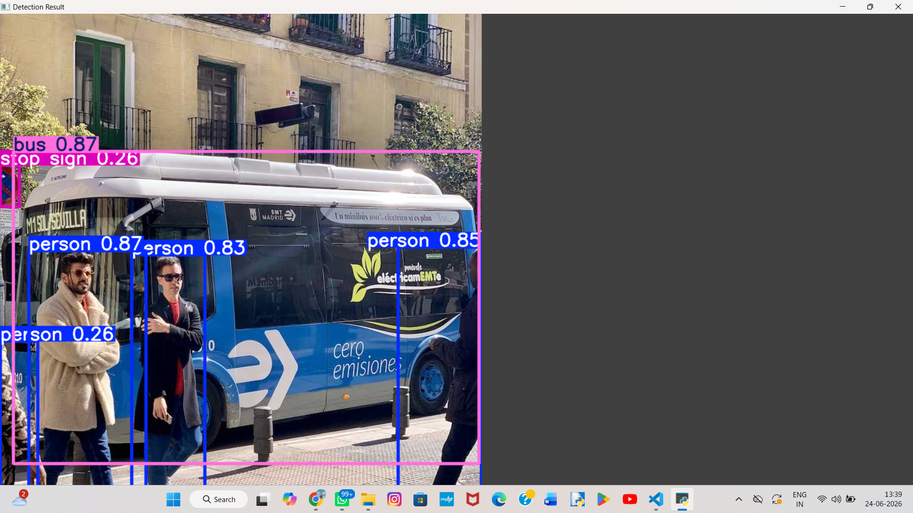

# Object Detection with YOLO

AI & Machine Learning Internship Project — CodeZoner (June 2026)

## Problem Statement
Detecting and identifying objects in real-time is a core challenge in 
computer vision. This project uses YOLOv8 to detect objects in images 
and videos automatically.

## Solution
Used YOLOv8 (You Only Look Once) pretrained model to detect objects 
in images and videos with bounding boxes and confidence scores.

## Tech Stack
- Python 3.x
- YOLOv8 (Ultralytics)
- OpenCV
- Matplotlib

## Results
- Detected persons, vehicles, and signs in images
- Detected persons, trucks, and fire hydrants in video frames
- Average inference speed: ~70ms per frame

## How to Run
pip install ultralytics opencv-python matplotlib

python detect_image.py
python detect_video.py

## Sample Output

## Author
Naveen B — CZ-2026-0169 — CodeZoner June 2026